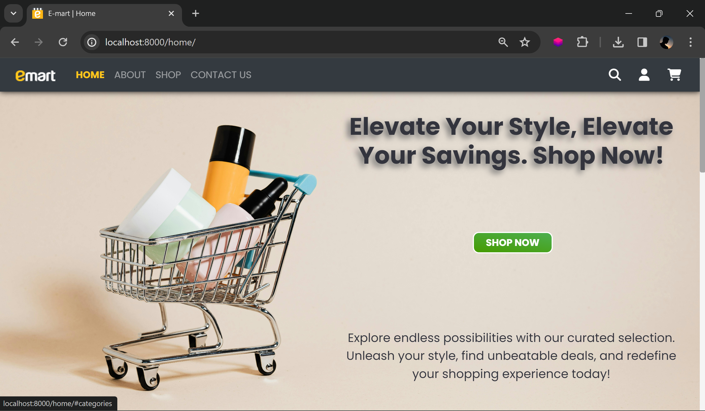

# ' emart ' an e-commerce Website Project with Django

### This is a simple responsive e-commerce website project built using Django. It allows users to browse and search products, add them to cart, and proceed to checkout, create account and login.

## Features

- **User Authentication and Authorization:** Allow users to register, log in, and manage their accounts. Implement authentication and authorization to restrict access to certain parts of the site.
- **Product Browsing and Searching:** Users can browse through available products, through categories and search for specific items.
- **Shopping Cart Functionality:** Enable users to add products to their cart, view the contents of their cart, update quantities, and remove items.
- **Manage Profile:** Allow users to view their details in dashboard, and manage passwords or Address.

### Installation

<details>
<summary>Click to view</summary>

<br/>

1. Clone the repository:

   ```bash
    git clone https://github.com/Mahesh-Maddhi/e-commerce.git
   ```

2. Navigate into the project root directory:

   ```bash
   cd emart
   ```

3. Create a virtual environment:

   ```bash
   python -m venv venv
   ```

4. Activate the virtual environment:

   a. For bash Terminal

   ```bash
   source venv/bin/activate
   ```

   b. For windows Terminal

   ```bash
   venv\Scripts\activate
   ```

5. Install dependencies:

   ```bash
   pip install -r requirements.txt
   ```

6. Apply migrations:

   ```bash
   python manage.py migrate
   ```

7. Run the development server:

   ```bash
   python manage.py runserver
   ```

8. Visit `http://localhost:8000` in your web browser to view the application.

</details>

### Usage

- Browse products: Navigate to the homepage to view available products in the categories or shop section.
- Register and login: Navigate to the profile to view dashboard and profile information and register/login.
- Add products to cart: Click on a product to view details, then click 'Add to Cart'.
- Proceed to checkout: Go to the cart page and click 'Make Purchase' to view order summary.
- Place order: Go to the cart page and click 'Place Order' to finalize your order.

### previews

<details>
<summary>Click to View</summary>

<br/>

- #### Home page



- #### Categories section


- #### Shop section


- #### Product section


- #### Cart page


- #### Footer page


- #### Mobile view


</details>

### Responsive Design with Media Queries

To ensure your web application or website looks great on various devices,I used CSS media queries. This allowed to apply different styles based on the characteristics of the device, such as its width.

#### Design parameters

- **Mobile View:** device-width(425px)
- **Tablet View:** device-width(768px)
- **Laptop View:** device-width(1024px)

### Resources

- The images, logos used in this website are downloaded from internet.
- The Icons used in this website are embeded from [Fontawesome](https://fontawesome.com/icons).
- The CSS framework used in this project is [Bootstrap](https://getbootstrap.com/).
- Special thanks to [DummyJSON](https://dummyjson.com/) for providing product details and product image links through API.

### Aknowledgement

- Thanks to [CodeWithHarry](https://www.youtube.com/@CodeWithHarry) youtube channel for providing Django Free Course.
- [Django](https://www.djangoproject.com/) documentation has been very helpful while developing the website.
- Drawing inspiration from the E-mart logo featured on [emart-Korea](https://company.emart.com/en/main.do), this website is designed.
